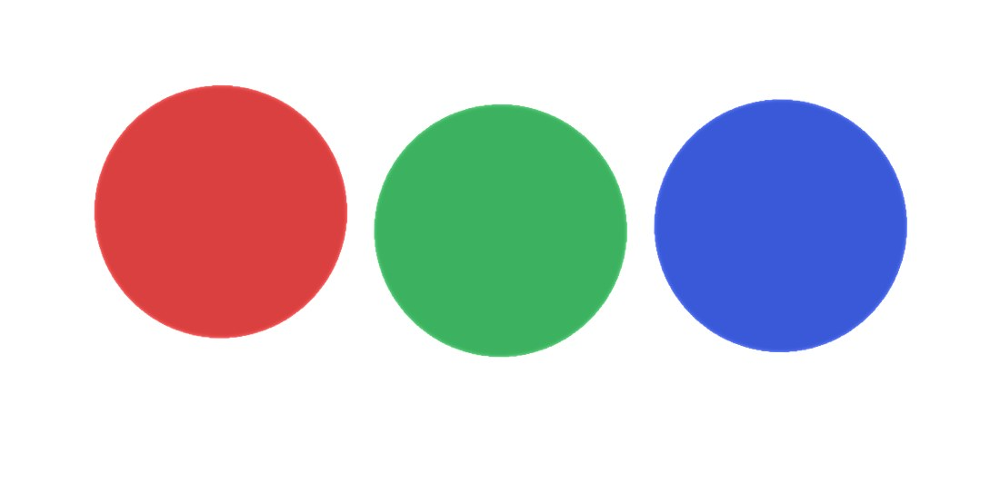
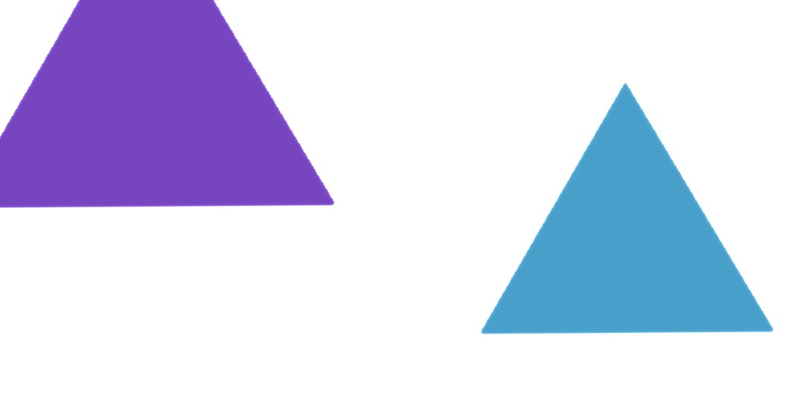

# PHASE 19 —— 模板化 / 通用性验证

> 目标：把「能跑的示例」变成「别人能用的引擎」。
>
> 判定方式不是"我觉得它通用了"，而是**换一套完全不同的素材，看它会不会露馅**。

---

## 一、通用性审计

先搜引擎层（`engine/` `animation/` `schema/` `asset-pipeline/` `components/` `config/`）
里有没有对具体内容的依赖：

```bash
grep -rniE "cat|猫" src/ | grep -v "^src/content/"
grep -rnE "'scene0|'bg'|subject-0" src/ | grep -v "^src/content/"
```

**结果**：引擎层里的"猫"**只出现在注释里**（举例说明），逻辑上零耦合。

但搜出 **3 处真正的特例**：

| # | 位置 | 问题 |
|---|---|---|
| 1 | `compose.ts` 写 `id: 'bg'`，`acceptance.ts` 用 `o.id === 'bg'` 认背景 | 靠**字符串魔法值**传递契约。换个 id 就失效，而且看不出这是契约；手写内容包不知道有这约定，验收会把"背景在动"当成"对象独立运动"的证据 |
| 2 | `DEFAULT_CONTENT_PACK = 'cats'` | 通用引擎的默认值指向一个具体素材包 |
| 3 | `src/content/shopify/` 依赖仓库外的素材 | 单独拿走引擎目录时会缺素材 |

### 修法 1：`role` 字段代替命名约定

```ts
// schema/object.ts
role?: 'background' | 'subject' | 'overlay';
```

和之前 `isHero: boolean` → `transition.mode` 是同一个改造思路：**用语义代替含糊的约定**。
顺带让验收多了一条反向断言 —— **背景必须是静止的**（背景若跟着轨道动，
"前景有视差"就失去参照了，而这种问题肉眼很难发现）。

### 修法 2：注释里说清它是示例

`cats` 读的是 `/content/manifest.json`，也就是**当前 `input/` 的产物** ——
所以即使不新建包，换掉 `input/` 里的图就能看到自己的内容。
`DEFAULT_CONTENT_PACK` 的注释现在明确写了"这是你唯一需要改的配置"。

### 修法 3：明确依赖边界

`shopify/index.ts` 现在写清楚了它依赖仓库外的素材、以及单独使用时的两种处理方式。

---

## 二、★ 探针素材验证（核心证据）

审计只能发现"写出来的耦合"，发现不了"没想到的假设"。
所以造一套**完全不同于猫图**的素材真跑一遍：

```bash
python .probe-input/make-probes.py       # 生成三张合成图
npm run build-assets -- --input .probe-input
```

| 图 | 尺寸 | 宽高比 | 背景 | 预期主体 |
|---|---|---|---|---|
| `probe01` | 1200×1200 | 1.000 | 纯白 | 3 个横向排开的圆 |
| `probe02` | 1920×1080 | 1.778 | 浅灰 | 1 个圆角矩形 + 柔和投影 |
| `probe03` | 800×1100 | 0.727 | 浅蓝 | 2 个三角 |

**结果**：

```
probe01  →  3 主体  313×313px  中心 (0.22 / 0.50 / 0.78, 0.52)   confidence high（裕度 14.07）
probe02  →  1 主体  667×632px  中心 (0.51, 0.56)                 confidence high（裕度 14.21）
probe03  →  2 主体  289×246 / 247×212                            confidence high（裕度 12.14）
```

| probe01（1:1，3 主体） | probe02（16:9，1 主体 + 阴影） | probe03（3:4，2 主体） |
|---|---|---|
|  |  |  |

三张都是真实渲染画面（canvas 像素导出）。注意 probe02 里那块方块的**柔和投影也被抠了进来** ——
这正是 3.4 说的已知限制在合成素材上的复现。

**零代码改动。** 三个不同的宽高比、三种不同的主体数量、三种背景色，全部正确。

浏览器里也验证了：验收脚本在探针素材上 **7 PASS / 0 FAIL / 144 fps**，
`role` 检查报告 "3 个对象在动，其中 3 种互不相同的屏幕位移轨迹；1 个静止（含 1 个背景）"。

---

## 三、探针暴露的三个问题

这一节是这次验证真正的价值 —— 前两个是**真实缺陷**。

### 3.1 ★★ `pyramid_inpaint` 在 1200×1200 上直接崩溃

```
IndexError: boolean index did not match indexed array along axis 0;
            size of axis is 8 but size of corresponding boolean axis is 9
```

**根因**：`_downsample` 用 `H // 2`（向下取整），而 `_upsample` 用 `repeat 2` ——
尺寸是**奇数**时两者不互逆：

```
9 → 4（丢掉 1 行）
4 → 8（repeat 2）
→ pull 阶段 pyr_img[lv][need] 两边形状对不上
```

**为什么一直没被发现**：原来的两张猫图是 1536×1024，金字塔各层
（1536→768→384→192→96→48→24→12→6→3）恰好都是偶数，整除，没丢过东西。
1200×1200 → …→ 75 → 37 → 18 → 9，在 9 那一层就炸了。

**而"用户提供任意尺寸的图"正是这个引擎的基本前提。**

**修复**：`_downsample` 改用 ceil（`(H+1)//2`），奇数时在右下**补零** ——
`img` 补 0 会被 `valid=0` 排除（不污染均值），`valid` 补 0 权重为零。
这样 ceil/floor 的差异只体现在"多带一个无效格"，而不是丢数据。

**并且给自检脚本补了断言**（原来 17 项 → 20 项）：

```python
odd_sizes = [(9, 9), (17, 5), (75, 75), (101, 37), (1, 1), (3, 200), (200, 3)]
chk("奇数/质数/极端尺寸都不崩且形状正确", shape_ok, f"扫了 {len(odd_sizes)} 种尺寸")
chk("奇数尺寸下常量图仍能还原", content_ok)
chk("_upsample(_downsample(x)) 尺寸可还原", inv_ok)
```

**不测某个具体尺寸，而是扫一批** —— 因为这类 bug 的特征就是"某个特定尺寸才触发"。

### 3.2 ★★ 纯色素材上出现刺眼的白点

probe01 的绿圆上冒出一个白点。追到过渡 shader 的**边界发光**：

即使 `uProgress = 0`，阈值场里的噪声扰动（`currentNoise * 0.2`）和法线扰动
也会让**极少数像素**的 `threshold` 略小于 0 ——
于是 `edge = progress - threshold ≈ 0`，满足"贴近边界"的条件，
那一两个像素就被乘上 `glowMult`（最高 40 倍）变成亮点。

**猫图看不出来**：浅色渐变背景上，一个白点和背景几乎同色。
**纯色/高对比素材是这类 artifact 的显影剂。**

**修复**：加一道「过渡是否正在发生」的闸门：

```glsl
float glowGate = smoothstep(0.0, 0.04, uProgress) * (1.0 - smoothstep(0.96, 1.0, uProgress));
outputColor = mix(outputColor, outputColor * glowMult, (1.0 - glowFactor) * glowGate);
```

物理上讲也更对：**没有过渡就没有边界，没有边界就没有边界发光。**

### 3.3 素材设计错误（不是引擎的问题）

前两版探针素材是错的，而**引擎的判定是对的**：

- 第一版 probe01 的圆半径 185px、圆心距 336px → **圆重叠** → 1 个连通域（正确）
- 第一版 probe03 的三角底边 400px、圆心距 288px → **横向重叠** → 1 个连通域（正确）

教训：**验证素材本身要先满足预期**，否则会把"素材画错了"误判成"引擎不行"。

### 3.4 意外复现的已知限制

probe02 里那个 600×560 的圆角矩形被检测成 **667×632** ——
多出来的正是柔和投影。这把"阴影被并入主体"从"猫图的特例"
提升为**可复现的普遍现象**，已写进 README 的已知限制。

---

## 四、脚手架

```bash
npm run new-pack dogs
```

生成 `src/content/dogs/{index.ts,site.ts}`，**生成后立刻可用**。

实现上有一件事值得说：**先把重复流程抽出来**。

在抽之前，每个素材驱动的包都要写一遍"读 manifest → 构图 → 收集置信度提醒"，
而第三步尤其容易漏 —— 漏了就等于"分割出问题但没人知道"。

现在抽成了 `src/content/build.ts`：

```ts
export async function buildContent(options: BuildContentOptions): Promise<ResolvedContent> {
  const manifest = await loadManifestCached(options.manifestUrl);
  const composed = composeContent(manifest, options);
  const notes = collectNotes(manifest);       // ← 不会漏了
  return { ...composed, notes };
}
```

于是 `cats` 包从 60 行缩到 30 行，而脚手架生成的包也只需要一行 `build`。

**模板里刻意不出现反引号**（除了最外层）—— shader 那次教训：
模板字符串套模板字符串极易出错，能避就避。

**实测**：生成 `demo` 包 → 标题变 "Demo"、2 场景 / 8 对象、
置信度提醒也继承了 → 删掉它，页面 HMR 后**回落到 `cats` 继续运行**（这顺带验证了验收 ①）。

---

## 五、通用性的最终证据

同一个引擎上跑着三种形态完全不同的内容：

| 包 | 形态 | 规模 |
|---|---|---|
| `cats` | 素材驱动：运行时读 manifest 自动构图 | 2 场景 / 6 平面对象 |
| `placeholder` | 手写场景，程序化抽象图 | 3 场景 / 9 对象 |
| `shopify` | 手写场景 + KTX2 压缩纹理 + GLB 蒙皮模型 | 4 场景 / **49,101 三角形** |

引擎对它们**一视同仁** —— 因为它只认 schema，不认内容。

这比任何架构图都有说服力。

---

## 六、修改的文件

| 文件 | 改动 |
|---|---|
| `src/schema/object.ts` | 新增 `role` 字段，替代 `id === 'bg'` 的命名约定 |
| `src/asset-pipeline/compose.ts` | 背景/主体分别声明 `role` |
| `src/dev/acceptance.ts` | 用 `role` 判断；新增"背景必须静止"的反向断言；后台节流报 SKIP 而非 FAIL |
| `src/content/build.ts` | **新建**。素材驱动包的公共骨架（含 notes 收集） |
| `src/content/cats/index.ts` | 60 行 → 30 行，改用 `buildContent` |
| `src/content/shopify/index.ts` | 补充角色说明与依赖边界 |
| `scripts/new-pack.mjs` | **新建**。内容包脚手架 |
| `scripts/build-assets/pipeline/imaging.py` | **修 bug**：`_downsample` 改用 ceil，支持任意尺寸 |
| `scripts/build-assets/pipeline/selftest.py` | 17 项 → 20 项，补任意尺寸断言 |
| `src/shaders/transition.ts` | **修 bug**：加 `glowGate`，消除纯色素材上的假亮点 |
| `src/config/content.config.ts` | 注释说清 `DEFAULT_CONTENT_PACK` 是唯一要改的配置 |
| `docs/内容包契约.md` | **新建**。怎么写自己的内容包 |
| `README.md` | 新增"用你自己的素材"章节、三个包的定位表 |

---

## 七、下一步

按路线图，剩下的是 **PHASE 4~9（引擎模块化 / 过渡系统）** 与 **PHASE 14（智能场景生成器）**。

**我的判断是这两块现在都不该做**：

- **PHASE 4~9**：代码已经在工作（双 RenderTarget、阈值场过渡、独立轨道求值、
  滚动驱动全部实测通过），只是没有按 PHASE 的形式拆成独立模块。
  拆分的收益是"结构更清晰"，但风险是**引入回归** —— 而现在没有任何症状说明它需要拆。
- **PHASE 14**：`composeContent` 已经承担了"场景生成器"的角色。
  想让它更"智能"（按内容语义选布局），需要**真实的多素材场景**来驱动设计。
  现在只有两张猫图 + 三张合成图，做出来大概率是过度设计。

**更值得做的**：
1. **把探针素材固化成 `npm run verify`** —— 一条命令跑"换一套素材 + 全链路验收"，
   作为改动引擎后的回归测试
2. **真的用它做一个非猫图的项目** —— 只有真实需求能暴露剩下的假设

---

## 附：探针素材怎么复现

```bash
# 生成（脚本在 .probe-input/，带完整的设计意图注释）
python .probe-input/make-probes.py

# 用探针素材跑流水线
npm run build-assets -- --input .probe-input

# 浏览器验证（三个场景自动出现，零代码）
npm run dev

# 恢复猫图
npm run build-assets
```

> `.probe-input/` 以 `.` 开头，不会被 `build-assets` 的默认 `input/` 扫到，
> 也不会被 git 当成普通目录 —— 它是个一次性的验证工具。
> 探针截图在 `docs/shots/probe-*.jpg`。
