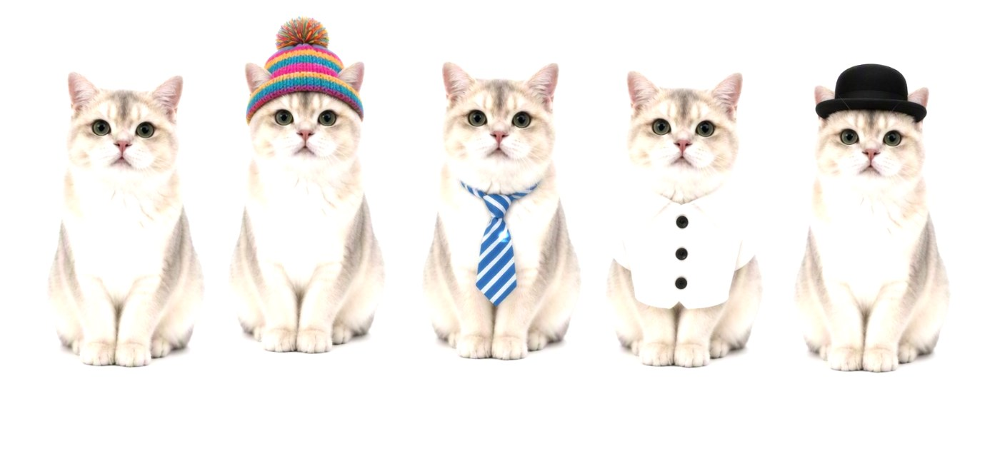
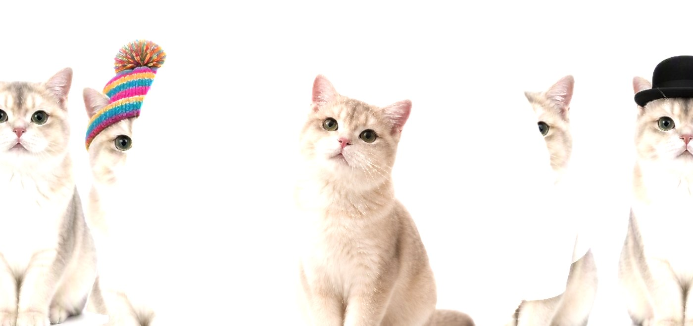
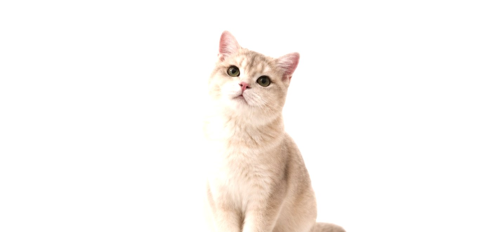

# PHASE 3 + 12 + 13 —— 统一 Scene Schema / 自动构图 / Motion Presets

> 这一阶段把「素材」真正变成了「场景」：**没有人写场景配置**。
>
> `input/scene01.jpg` → 5 只猫各自在正确的屏幕位置、各自用不同的方式运动、
> 相机有明显推进、章与章之间是 Shader 阈值场过渡。
> 全过程没有一行场景配置代码。

---

## 一、交付了什么

| 文件 | 角色 |
|---|---|
| `src/asset-pipeline/compose.ts` | **核心**。manifest → `{ assets, scenes }` 的纯函数 |
| `src/asset-pipeline/manifest.ts` | 运行时 fetch manifest + 结构校验 |
| `src/animation/presets.ts` | 13 个运动预设 + `expandPreset` |
| `src/content/cats/index.ts` | 素材驱动的内容包（全部内容 = 一次 manifest 读取） |
| `src/content/types.ts` | `ContentPack.build()` 动态内容钩子 |
| `src/schema/scene.ts` | `tracksOf()` 成为预设的唯一展开点 |
| `src/shaders/transition.ts` | 线稿从「替换颜色」改为「叠加边缘」 |
| `scripts/build-assets/pipeline/main.py` | 孤儿产物清理 |

---

## 二、数据流

```
input/*.jpg
   │  build-assets（Python）
   ▼
public/content/manifest.json          ← 运行时 fetch，不是构建期 import
   │  loadManifest()
   ▼
ContentManifest
   │  composeContent(manifest, { aspect })
   ▼
{ assets, scenes }                    ← 引擎只认这个
   │
   ▼
Composer → SceneBuilder → WebGL
```

**为什么 manifest 走 fetch 而不是静态 import**：
静态 import 会把 manifest 烘进 bundle，于是"重跑 build-assets 就能换内容"这件事在开发服务器上失效（要重启 + 重建）。fetch 让素材成为真正的运行时数据 —— 这是验收 7 的技术前提。

---

## 三、构图数学

自动构图要解决的是：**给定一张原图和一堆主体 bbox，把每个主体摆到屏幕上原本属于它的位置和大小上**。

### 3.1 `offset` 就是屏幕归一化坐标，且与 z 无关

`SceneBuilder` 里：

```
baseX = offset[0] × visibleH(z) × aspect
baseY = offset[1] × visibleH(z)
```

而屏幕在该深度处的可见宽高正好是 `visibleH×aspect` 和 `visibleH`。两边一除：

```
屏幕横坐标（−0.5..0.5） = offset[0]
屏幕纵坐标（−0.5..0.5） = offset[1]      （正值朝上）
```

`visibleH(z)` 被约掉了。**所以同一个 offset 在 z=−30 和 z=−14 上落在同一个屏幕位置。**

这意味着「按原图位置摆放」和「拉开 z 做视差」是两件互不干扰的事 —— 这是整个自动构图能成立的前提。

### 3.2 `overscan` 可以精确补偿透视缩放

`contain` 模式下平面先「完整放入视口」，再整体乘 `overscan`。而 `visibleH(z)` 随 z 增大，所以同样 overscan 的平面在世界里更大、但投影后**屏幕尺寸不变**。

→ **z 只影响视差强度，不影响构图。** 想拉开纵深就直接改 z，画面不会跟着变。

### 3.3 深度是反解出来的，不是盲分的

一个主体被放大多少倍，只取决于「它到相机的距离」和「相机走了多远」：

```
zoom(d) = d / (d + dolly)          （dolly < 0 ⇒ zoom > 1）
```

想让某个主体在推进过程中不超过 `maxScreenH`，就把 d 解出来：

```
screenH × zoom(d) ≤ maxScreenH
⇒ d ≥ maxScreenH × dolly / (screenH − maxScreenH)
```

**这条约束正好实现了「大主体自动放远」**：

| 场景 | 主体屏幕高度 | 解出的距离 d | 放大倍数 |
|---|---|---|---|
| scene02 | 1.024（超宽视口下） | 38（被 `bgDist−2` 钳制） | 1.19 |
| scene01 的猫 | 0.744 | 20 ~ 34（黄金比散布） | 1.21 ~ 1.43 |

换句话说 —— **越小的东西动得越狠**。纵深层次就是这么出来的。

### 3.4 源图 → 屏幕的映射

背景用 `cover` 铺满视口，于是源图被居中裁切。设 `fX = max(1, srcAspect/vpAspect)`、`fY = max(1, vpAspect/srcAspect)`：

```
sx = (cx − 0.5) × fX
sy = (0.5 − cy) × fY
主体屏幕高度占比 = box.h × fY
```

> ⚠️ `box.w/h` 是**源图归一化坐标**（x 除以图宽、y 除以图高），所以是非等比的。
> `box.w / box.h` **不等于** `subject.aspect`。后者是裁剪后 PNG 的真实宽高比。
> 实测：scene01/subject-01 的 `box.w/box.h = 0.366`，而 `aspect = 0.549`。

### 3.5 两个尺寸钳制

| 参数 | 作用 | 为什么需要 |
|---|---|---|
| `maxSubjectH = 0.92` | 主体**初始**占屏高度上限 | 超宽视口下 cover 会把源图纵向放大（3:2 的图配 21:9 视口放大 1.55 倍），主体跟着冲出画面 |
| `maxScreenH = 1.05` | 相机推进**结束**时允许的高度 | 允许轻微出界（耳朵、脚），但不允许整个跑掉 |

**只钳制尺寸、不钳制位置** —— 中心点仍与背景对齐，所以主体"还在原处"，只是收进屏幕内。代价（屏幕尺寸比原图比例略小）实际为零：

- 背景在 build-assets 阶段已经把主体区域**填充掉了**，背景上不存在"猫的轮廓"等着被对齐；
- 主体 PNG 自带接触阴影，阴影跟着一起缩放，不会脱节。

---

## 四、Motion Presets（PHASE 13）

13 个预设：`pinned` `float` `sway` `drift` `breathe` `fadeIn` `fadeOut` `rise` `sink` `scatter` `orbit` `pushIn` `exitDown`。

### 单位约定

`position.x` 的轨道值**就是屏幕宽度的比例**，`position.y` 的轨道值**就是屏幕高度的比例** —— 与视口宽高比无关。所以 `0.02` = 屏幕的 2%，不需要任何换算。

### 一个硬约束：三类动效必须动不同的属性路径

求值器按 `path` 覆盖。所以：

| 动效类型 | 只能动 | 原因 |
|---|---|---|
| 入场 | `opacity` | 用 `position.y` 会把持续运动的轨道顶掉 |
| 持续运动 | `position.*` | |
| 呼吸 | `scale.*` | |

`compose.ts` 里的 `assertNoPathCollision` 会在开发时把这个静默 bug 变成一条警告。

### 预设在哪一层展开

`schema/scene.ts` 的 `tracksOf()` 是**唯一**的展开点。

- `compose.ts` 直接写展开好的 `animation.tracks`；
- 手写内容包可以写 `{ preset: 'scatter' }`，由 `tracksOf` 展开。

两条路汇到同一个结果，且 `tracksOf` 是幂等的。放在唯一入口而不是 `SceneBuilder` 里，是因为**每条读取轨道的代码路径都各自记得展开一次**必然会漏。

---

## 五、内容包的两种形态

```ts
// 静态包（placeholder / shopify）—— 直接给数据
{ id, label, site, assets, scenes }

// 动态包（cats）—— 运行时才知道有哪些场景
{ id, label, site, build: async ({ aspect }) => ({ assets, scenes, notes }) }
```

`build()` 拿到 `aspect` 而不是自己去读 `window`，是为了让包保持纯函数：给定 `(manifest, aspect)` 永远同样的结果，可以在 Node 里跑测试或做离线预览。

`notes` 是一个刻意加的通道：内容包可以把「某张图分割置信度偏低」这类非致命提醒一路带到**调试面板**上，而不是只 `console.warn`。理由和 build-assets 的"不要静默产出垃圾掩码"是同一条 —— **没人会去翻终端**。

---

## 六、实测验证

在 `localhost:5199`，视口 1429×674 CSS（aspect 2.12），144 fps。

### 画面

| 首屏 · scene01 五只猫 | 过渡中 · 径向溶解 | scene02 · 单猫 |
|---|---|---|
|  |  |  |

三张都是**真实渲染画面**（canvas 像素导出，不是 Chrome 视口截图，所以不含 DOM 覆盖层）。
重新生成的方式见本节末尾。

- **首屏**：5 只猫各自在原图位置，毛线帽 / 领带 / 衬衫 / 圆顶礼帽全部保留。
  注意每只猫的尺寸不同 —— 那是 `overscan` 在还原原图里的相对大小。
- **过渡**：中间的猫是 scene02 的内容，两侧是 scene01。两张图的背景都是浅白，
  所以溶解边界不像深色素材那样醒目 —— 这是素材特性，不是过渡没生效。
- **scene02**：主体占 92% 屏高（被 `maxSubjectH` 钳制过，原本会算出 1.024 屏高）。

### 验收对照

| # | 验收标准 | 结果 | 证据 |
|---|---|---|---|
| 1 | 删除内容后引擎仍可运行 | ✅ | `?content=placeholder` → 3 场景 / 9 对象，与 cats 完全独立 |
| 2 | 只提供两张图可生成基础 Scene | ✅ | manifest 由两张图生成 2 场景 / 6 主体 |
| 3 | Scene01→02 可通过滚动控制 | ✅ | 章节高度 1347px，`current.progress` 随 scrollY 连续变化 |
| 4 | Scene 内多个对象独立运动 | ✅ | 见下表 |
| 5 | Camera 有明显空间运动 | ✅ | z 6→0、y −1.2→1.2、roll 0.012→−0.012 |
| 6 | Transition 用 RenderTarget + Shader + Noise | ✅ | 双 RT 交叉溶解，圆形阈值场 + 噪声 + 法线扰动，边界有发光 |
| 7 | 替换图片不改核心代码 | ✅ | cats 包零场景配置 |
| 8 | 新增 Scene03 不需重写引擎 | ✅ | 见下 |

### 验收 4：对象独立运动（scene01，t = 0 → 1）

```
subject-01  float   y:  0.03 →  0.22 →  0.03 → −0.17 →  0.03
subject-02  sway    x: 12.69 → 12.91 → 12.70 → 12.46 → 12.69
subject-03  orbit   x/y 双轴椭圆
subject-04  drift   x: −14.39 → −14.33 → −14.06 → −13.74 → −13.64   （单向）
subject-05  float   y: −0.62 → −0.34 → −0.61 → −0.91 → −0.62
bg          pinned  完全不动
```

五个主体五种运动方式，互不重复。

### 验收 5：相机

```
t=0     position(0, −1.2, 6)      roll  0.012
t=0.25  position(0, −0.9, 5.25)   roll  0.009
t=0.5   position(0,  0.0, 3)      roll  0
t=0.75  position(0,  0.9, 0.75)   roll −0.009
t=1     position(0,  1.2, 0)      roll −0.012
```

推进 6 个单位、上下平移 2.4 个单位。因为物体分布在 z = −15 ~ −26，近处主体放大 1.43 倍、远处只有 1.21 倍 —— **视差是透视投影的几何后果**。

### 验收 8：新增 Scene03

```
cp input/scene02.jpg input/scene03.jpg
npm run build-assets        →  完成：3 个场景 / 7 个主体
刷新页面                    →  sceneCount: 3, domSections: 3
```

TS 代码零改动。调试面板同时列出了 2 条置信度提醒。

清理时发现一个缺陷并修掉：删掉 `input/scene03.jpg` 重跑后，`public/content/scene03/` 和 `generated/preview-scene03.png` **残留了**。现在 build-assets 会读一个状态文件（`public/content/.generated-scenes.json`），只删「自己上一轮生成过、这一轮不存在」的目录 —— **不会碰手写内容包的资产**（`placeholder/` 验证完好）。

### 截图是怎么生成的

`chrome-devtools` MCP 的 `take_screenshot` 只能写到它自己的 workspace root，写不进本项目。
所以用页面自己把 canvas 像素 POST 出来：

```bash
# 1. 起接收服务（后台）
python scripts/capture-server.py 8899

# 2. 在浏览器控制台 / MCP evaluate_script 里跑：
#      requestAnimationFrame(() => { ... canvas.toDataURL ... fetch POST ... })
#    完整脚本见本节下方的历史记录，或照着 capture-server.py 的协议自己写：
#    POST body = {"name": "xxx.jpg", "b64": "<无前缀 base64>"}
```

> 关键点：`toDataURL` 必须在 `requestAnimationFrame` 回调里调 ——
> WebGL canvas 默认 `preserveDrawingBuffer: false`，rAF 之外读会拿到空白。

---

## 七、修掉的 bug

| # | 症状 | 根因 |
|---|---|---|
| 1 | 越滚越远，没有推进感 | `dolly = +4`，而 three 的相机看向 −z —— **相机在后退**。改成负值 |
| 2 | 打开页面只有空背景，5 只猫全透明 | 首屏 `t=0`，而 `fadeIn` 在 `t=0` 时 opacity 恰好是 0。首屏不做淡入 |
| 3 | 超宽视口下主体整个冲出画面 | cover 放大 + 主体本来就高（scene02 算出 1.024 屏高）。加 `maxSubjectH` 钳制 |
| 4 | 过渡时整屏变成「黑底白线」线稿 | shader 用 `vec4(currentEdges, 1.0)` **替换**颜色，非边缘处 `edges ≈ 0` → 纯黑。改成叠加 |
| 5 | 改完叠加后画面全白，只有零星噪点 | 误判了 `fwidth` 的量级（以为 ~0.004，实际强边缘接近 **1.0**），乘 8.5 再乘 6 = 51 倍过曝。改为先 clamp 到 0..1 |
| 6 | 浅色猫被均匀加亮，像褪了色 | 毛发这类高频纹理在 `fwidth` 上到处都是"边缘"。加 `smoothstep(0.25, 0.9)` 强边缘阈值 |
| 7 | `Expected ";" but found "fwidth"` | GLSL 内联在模板字符串里，注释中写反引号**截断了字符串**。踩了两次 |
| 8 | dev server 启动报 500，错误指向 `generated/report.html` | vite 默认把所有 `*.html` 当扫描入口，而 build-assets 会往 `generated/` 写一份几 MB 的报告。显式指定 `optimizeDeps.entries: ['index.html']` |
| 9 | 调试面板 textures 恒显示 0 | 读的是 `composer.textureCount`（不存在），实际在 `composer.stats.textureCount` |

---

## 八、已知限制

- **过渡在两张浅色图之间区分度低。** scene01 和 scene02 都是浅色猫图，过渡时看起来像"褪色"而不是"换场"。这是素材特性，不是引擎问题 —— 原站各章色彩差异大，过渡更有戏剧性。
- **主体自带接触阴影**（见 PHASE 2 文档）。
- **页面 resize 后不自动重新构图。** `composeContent` 的 `aspect` 在加载时取一次，之后要刷新页面。这是 PHASE 17 的工作。
- **`maxSubjectH` 是全局值**，不区分场景。极端素材（比如一张竖长条图）可能仍会出界。

---

## 九、下一步

按路线图，PHASE 4 ~ 10 是**引擎模块化与过渡系统**。但本次实测显示这些模块**已经在工作**（双 RenderTarget、阈值场过渡、独立轨道求值、滚动驱动都在跑），只是还没有按 PHASE 的形式拆分与验收。

所以下一步优先级建议：

1. **PHASE 17 响应式** —— 目前最影响实际使用的一项（resize 不重构图）
2. **PHASE 11 里程碑验收** —— 把「五猫 → 滚动 → 相机推进 → Shader 转场 → 单猫定格」这条链路固化成可重复的验收脚本
3. **PHASE 4 ~ 10** —— 补文档与验收，代码本身大概率不用大改
